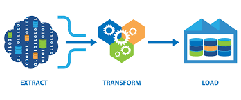

# Introducción {.unnumbered}

Bienvenido a la documentación técnica oficial del sistema **HGC Business Intelligence**. Este documento detalla la arquitectura, funcionalidades y especificaciones matemáticas del proyecto, enfocado en la optimización operativa del sector Fast Food.

## ÍNDICE GENERAL

**CAPÍTULO I: MARCO REFERENCIAL DEL NEGOCIO**  
1. Introducción  
2. Contexto Organizacional  
3. Estudio de Mercado y Situación Actual  
4. Diagnóstico y Problemática Actual  
5. Justificación  
6. Objetivos del Proyecto  
7. Alcance, Limitaciones y Exclusiones  

**CAPÍTULO II: MARCO TEÓRICO Y FUNDAMENTOS DE BI**  
1. Inteligencia de Negocios y Evolución Analítica  
2. Arquitecturas Modernas de Datos  
3. Procesamiento y Transformación (ETL/ELT)  
4. Modelado Dimensional (Kimball)  

**CAPÍTULO III: ANÁLISIS DE REQUERIMIENTOS Y FUENTES DE DATOS**  
1. Identificación de Fuentes de Información  
2. Levantamiento de Requerimientos por Área  
3. Definición y Justificación de KPIs  

**CAPÍTULO IV: MODELADO DIMENSIONAL (GALAXY SCHEMA)**  
1. Identificación de Procesos de Negocio  
2. Matriz Bus de Kimball  
3. Definición de Dimensiones y Atributos  
4. Definición de Tablas de Hechos  
5. Diagrama del Modelo Físico (Galaxy)  
6. Diccionario de Datos Dimensional  

**CAPÍTULO V: ARQUITECTURA PROPUESTA Y STACK TECNOLÓGICO**  
1. Visión General de la Arquitectura  
2. Stack de Tecnología Seleccionado  
3. Diagramas de Arquitectura (Alto Nivel)  
4. Pipeline de Ingesta y Procesamiento  
5. Transformación de Datos con dbt  

**CAPÍTULO VI: DISEÑO DE DASHBOARDS Y VISUALIZACIÓN**  
1. Estrategia de Visualización y Audiencia  
2. Diseño de Dashboards por Requerimiento  
3. Navegación y Storytelling con Datos  

**CAPÍTULO VII: ANALÍTICA PREDICTIVA Y MACHINE LEARNING (PREDICTIONS)**  
1. Fundamentación Técnica de Modelos Predictivos  
2. Ingeniería de Características en dbt  
3. Desarrollo del Motor de Inferencia (ML Backend)  
4. Interfaz de Usuario y Visualización Predictiva  
5. Estrategia de Despliegue y MLOps  

**CAPÍTULO VIII: ANÁLISIS DE SERIES DE TIEMPO Y PRONÓSTICOS (TIME_SERIES)**  
1. Base Teórica de Series Temporales en Fast Food  
2. Preparación y Agregación Temporal (dbt)  
3. Motor de Simulación y Forecast (Backend)  
4. Dashboards de Proyección y Simulación Interactiva  

**CAPÍTULO IX: MODELADO ECONOMÉTRICO Y EFICIENCIA OPERATIVA (ECONOMETRICS)**  
1. Fundamentos de Econometría (Cobb-Douglas & SFA)  
2. Implementación de Lógica Económica en dbt  
3. Motor de Análisis Estadístico (Backend)  
4. Dashboard de Eficiencia Estratégica (Frontend)  
5. Despliegue e Impacto en la Toma de Decisiones  

**CAPÍTULO X: GOBERNANZA, CALIDAD Y DESPLIEGUE**  
1. Estrategia de Despliegue y Pruebas  
2. Gobernanza y Seguridad de la Información  
3. Monitoreo del Pipeline y Mantenimiento  

**CAPÍTULO XI: CONCLUSIONES Y RECOMENDACIONES**  
1. Conclusiones Generales  
2. Aporte del Proyecto al Negocio  
3. Recomendaciones Estratégicas y Líneas Futuras  

---

{width=80% fig-align="center"}

